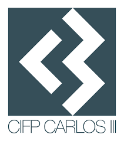

# Documentación para Desarrollo de Interfaces 

Documentacióm para el módulo de diseño de interfaces del ciclo formativo formativo de grado superior 
en desarollo de aplicaciones multiplataforma del CIFP Carlos III (Cartagena)

