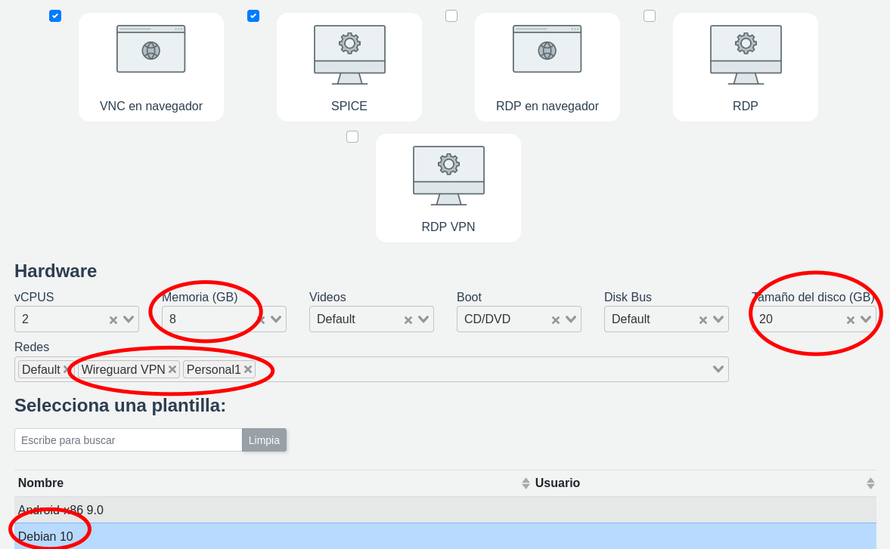
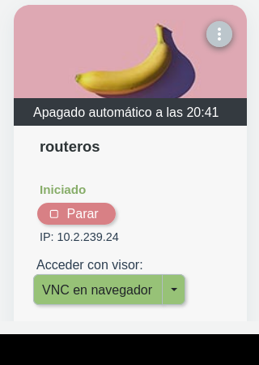
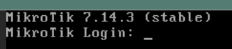
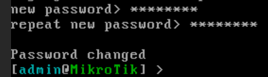
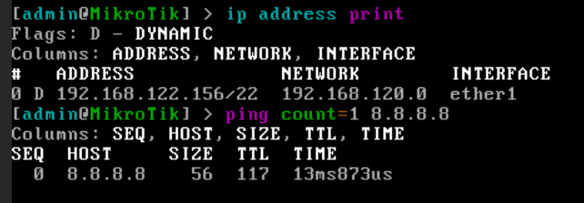
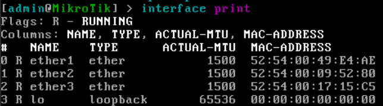
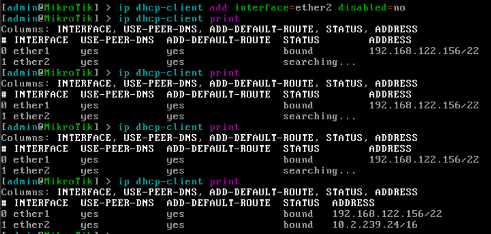
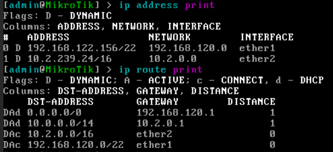
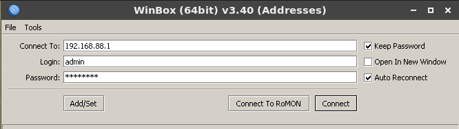

# 1. Routers con mikrotik y alpine linux

Queremos preparar una plantilla de router mikrotik y de alpine que pueda usarse en el siguiente escenario:

```
                                                         xxxx x xxx    
                                                     xxx          xx   
                                             xxxxxxxx              xx  
                  ┌───────────┐            xx                       x  
                  │ ROUTER    │           xx                        x  
                  │ defult    ├───────────xx         internet       x  
                  │ isard     │            xx                       x  
                  └─────┬─────┘              xxxxxx                 x  
                        │.1                        x xx x x x  x x x   
                        │       red default                            
     ──┬────────────────┴────────────────────────────                  
       │                        192.168.120.0/22                       
       │                                                               
  dhcp │.x.y                                                           
┌──────┴────────────┐                                                  
│    inet           │                                                  
│                   │                                                  
│  ESCRITORIO       │dhcp    red wireguard-vpn                         
│  ROUTER ISARD  vpn├───────────────────────────────────────┬────────  
│                   │.X.Y      10.2.0.0/16                  │          
│     lan1          │                                       │.0.1      
└──────┬────────────┘                               ┌───────┴────────┐ 
       │.1                                          │  FIREWALL      │ 
       │            red personal 1                  │  ISARD         │ 
    ───┴────────┬──────────────────────             └──────┬─────────┘ 
                │    192.168.88.0/24                       │           
            dhcp│.X                                        │           
         ┌──────┴──────┐                                  ┌┴┐          
         │    eth0     │                                  │V│          
         │             │                                  │P│          
         │  ESCRITORIO │                                  │N│          
         │             │                                  └┬┘          
         │  acceso     │                                   │10.0.X.Y   
         │  a internet │                        ┌──────────┴──────────┐
         │  por red    │                        │    wireguard        │
         │  personal   │                        │                     │
         │             │                        │       MI PC         │
         │ configurar  │                        │ con fichero wireguad│
         │ mikrotik    │                        │ de usuario isard    │
         └─────────────┘                        │                     │
                                                └─────────────────────┘
```

## Mikrotik RouterOS en Isard

Un escritorio con sistema operativo RouterOS de mikrotik que usaremos para dar acceso a internet a un escritorio que se conectará a la red personal. Este router hará nat "masquerade" hacia la red default y también tendrá un servidor dhcp. Se podrá acceder también a través de la red vpn personal para poderlo configurar desde nuestro pc. Esta configuración puede servir de base para otras prácticas más complejas de redes.

### Crear escritorio con routerOS base clonando el disco desde fichero de imagen

Creamos un desktop basado a partir de una iso de system rescue cd:



Arrancamos el system rescue cd, ahora queremos entrarle por ssh para poder copiar y pegar comandos... Para eso, como no tenemos interface gráfica, lo mejor es conectarnos por ssh a ese escritorio. Para eso hemos de usar la vpn personal. Nos descargamos el fichero de vpn personal. Lo movemos a la carpeta de wireguard y le cambiamos el nombre de isard-vpn.conf a docente43.conf

```
sudo mv ~/Descargas/isard-vpn.conf /etc/wireguard/docente43.conf
```

Levantamos la vpn:

```
sudo wg-quick up docente43
```

En la card aparece la ip una vez el escritorio ha arrancado:




Verificamos que le podemos hacer ping desde nuestro equipo:

```
➜  ~ ping -c 1 10.2.239.24
PING 10.2.239.24 (10.2.239.24) 56(84) bytes of data.
64 bytes from 10.2.239.24: icmp_seq=1 ttl=63 time=23.8 ms

--- 10.2.239.24 ping statistics ---
1 packets transmitted, 1 received, 0% packet loss, time 0ms
rtt min/avg/max/mdev = 23.769/23.769/23.769/0.000 ms

```

Ahora para poder conectarnos por ssh hemos de hacer algunas configuraciones en el escritorio. Nos conectamos con el visor spice o vnc y hacemos varias operaciones:

```bash
# cambiar el teclado a español
setkmap es

# quitamos reglas de firewall y ponermos política por defecto ACCEPT
# iptables -X: Elimina todas las cadenas de reglas personalizadas menos las predeterminadas.
# iptables -F: Borra todas las reglas dentro de todas las cadenas
# iptables -P INPUT ACCEPT: Establece la política predeterminada para la cadena INPUT.
# Todas las conexiones entrantes serán aceptadas por defecto
iptables -X; iptables -F; iptables -P INPUT ACCEPT
```

verificamos que no quedan reglas de firewall y que el servicio de ssh está escuchando:

```bash
iptables-save
ss -tlnp
```

La salida esperada de estos comandos es:
```
[root@sysrescue ~]# iptables-save
*filter
:INPUT ACCEPT [78:13518]
:FORWARD DROP [0:0]
:OUTPUT ACCEPT [172:18618]
:LOGDROP - [0:0]
COMMIT

[root@sysrescue ~]# ss -tlnp
State        Recv-Q       Send-Q             Local Address:Port               Peer Address:Port       Process                              
LISTEN       0            128                      0.0.0.0:22                      0.0.0.0:*           users:(("sshd",pid=375,fd=3))       
LISTEN       0            128                         [::]:22                         [::]:*           users:(("sshd",pid=375,fd=4)) 
```

cambiamos el password de root:
```
passwd
```

Ya deberíamos poder entrar por ssh al escritorio desde nuestra terminal:

```
ssh root@10.2.239.24
```

Una vez dentro del escritorio podemos ir copiando y pegando órdenes.

Vamos a la web de mikrotik al apartado de descargas donde están todas las versiones: 

https://mikrotik.com/download/archive

Buscamos la imagen estable más reciente, en su vesión **img**,  chr-VERSION-img.zip, actualmente la última estable es:  **chr-7.14.3.img.zip**.

La url de descarga es: https://download.mikrotik.com/routeros/7.14.3/chr-7.14.3.img.zip

y en la misma web de descargas nos indican que la firma sha256 de este fichero es:
064d82932c305c8fb8f681a526b2f159133684f74ca493560cfabdc00798d912

Para descargar la imagen observamos que disponemos de 4GB en el directorio temporal
```
[root@sysrescue ~]# df -h /tmp
Filesystem      Size  Used Avail Use% Mounted on
tmpfs           3.9G     0  3.9G   0% /tmp
```

Podemos descargar el fichero en este directorio y verificar la firma:

```
wget -O /tmp/routeros.img.zip https://download.mikrotik.com/routeros/7.14.3/chr-7.14.3.img.zip
sha256sum /tmp/routeros.img.zip
```

Una vez verificada que la firma es válida, procedemos a descomprimir el contenido:
```
unzip -d /tmp/ /tmp/routeros.img.zip
```

Que descomprime un fichero con una imagen de disco de 128M:
```
[root@sysrescue /tmp]# ls -lh /tmp/*.img
-rw-r--r-- 1 root root 128M Apr 17 13:50 /tmp/chr-7.14.3.img
```

Ahora hemos de clonar esta imagen en el disco virtual /dev/vda
```
[root@sysrescue /tmp]# hdparm /dev/vda

/dev/vda:
 readonly      =  0 (off)
 readahead     = 256 (on)
 geometry      = 41610/16/63, sectors = 41943040, start = 0

```

Para ello usaremos la herramienta dd:
```
# if: input file, en este caso el fichero de imagen de disco
# of: output file, en este caso es un dispositivo de disco virtual
# bs: tamaño de bloque de lectura y escritura, para ficheros grandes agiliza la escritura que si no por defecto se hace en bloques pequeños
# status: le indica que queremos ir viendo el progreso, útil si el fichero fuese muy grande, en nuestro caso será casi instantáneo

dd if=/tmp/chr-7.14.3.img of=/dev/vda bs=1M status=progress
```

Ahora podemos apagar el escritorio virtual con:
```
poweroff
```

Ahora podemos editar el escritorio, y prepararlo para crear una plantilla. Al editar:
- vcpus: podemos dejar las **dos vcpus**
- reducir la memoria a **1GB**
- cambiar **boot a Disco Duro**
- redes en orden, podemos añadir más o cambiar en función de lo que deseemos que quede fijado en la plantilla, luego los alumnos la pueden cambiar al crear el escritorio. Es habitual que la primera interface de salida a internet (**default**), en nuestro caso la segunda dará acceso a la red de vpn (**wireguardVPN**) y la tercera interface estará conectada a la red personal (**Personal1**)
- **quitar iso** de system rescue cd
- subimos una imagen como logo de mikrotik y la seleccionamos

Una vez hechos los cambios de hardware convertimos el escritorio en plantilla, de nombre: **routeros 7.14**

Ahora ya podemos seguir trabajando con nuestro escritorio, que ahora estará basado en esta nueva plantilla.

### Config incial mikrotik

Una vez arranca el escritorio, habrá pillado la imagen de mikrotik para arrancar y nos dará acceso a la línea de órdenes de mikrotik, como si nos hubiésemos conectado por telnet o puerto serie la primera vez al router. Nos ha de aparecer una pantalla como esta:



Entramos con admin / sin password

Lo primero que nos pide es que le demos un password, en este caso le hemos puesto la contrasñea habitual de nuestras plantillas "pirineus". Y accedmos al prompt de mikrotik:



Podemos verificar que tiene salida a internet:



Lo primero que nos interesa es poder trabajar más cómodamente, con una terminal donde podamos hacer copy/paste y no con un visor que al no tener interface gráfica no me permite usar el portapapeles entre el escritorio virtual y nuestro equipo.

Para eso habremos de habilitar la interface de wireguard vpn. Habremos de decirle al router que queremos que en la segunda interface obtenga una ip por dhcp. La red de wireguard-VPN ofrece una ip dinámica pero sin gateway por defecto. 

Revisamos que las interfaces están activas y vemos el nombre que tienen:

```
interface print
```




La segunda interface se llama **ether2**.

Pasamos a configurar que obtenga una ip por dhcp, y esperamos hasta que obtenga ip:

```
ip dhcp-client add interface=ether2
```




Revisamos que las ips y las rutas son correctas. Ha añadido reglas de routing para que podamos acceder desde nuestro equipo a través de la vpn personal:

```
ip address print
ip router print
```




En este caso la ip que me se ha obtenido en la interface ether2 es 10.2.239.24

Ya deberíamos poder hacer ping y acceder por ssh desde nuestro equipo. Al conectar por ssh como anteriormente nos conectamos por esa misma ip al system rescue cd, es probable que nos diga que hay un conflicto de claves en ~/.ssh/known_hosts que podemos resolver borrando la clave anterior con:

```
ssh-keygen -f ~/.ssh/known_hosts -R "LA_IP_DEL_ESCRITORIO_EN_LA_RED_DE_WIREGUARD_VPN"
```

Para acceder lo haríamos lo hemos de hacer con el usuario admin

```
ssh admin@LA_IP_DEL_ESCRITORIO_EN_LA_RED_DE_WIREGUARD_VPN
```

El resultado debería ser algo similar a:

```
➜  ~ ssh admin@10.2.239.24                              
The authenticity of host '10.2.239.24 (10.2.239.24)' can't be established.
RSA key fingerprint is SHA256:+xpN6EIEw3LTfCzrmH7VWOwGN1cRqCH4RhaB8LkATEs.
This key is not known by any other names
Are you sure you want to continue connecting (yes/no/[fingerprint])? yes
Warning: Permanently added '10.2.239.24' (RSA) to the list of known hosts.
admin@10.2.239.24's password: 
 

  MMM      MMM       KKK                          TTTTTTTTTTT      KKK
  MMMM    MMMM       KKK                          TTTTTTTTTTT      KKK
  MMM MMMM MMM  III  KKK  KKK  RRRRRR     OOOOOO      TTT     III  KKK  KKK
  MMM  MM  MMM  III  KKKKK     RRR  RRR  OOO  OOO     TTT     III  KKKKK
  MMM      MMM  III  KKK KKK   RRRRRR    OOO  OOO     TTT     III  KKK KKK
  MMM      MMM  III  KKK  KKK  RRR  RRR   OOOOOO      TTT     III  KKK  KKK

  MikroTik RouterOS 7.14.3 (c) 1999-2024       https://www.mikrotik.com/

Press F1 for help

[admin@MikroTik] > 

```

Y ya tenemos acceso a wireguard por la línea de comandos

### Configurar red interna con servidor de dhcp y vpn

Ahora hemos de configurar una red interna donde queremos que el router haga de servidor dhcp y enmascare la salida a internet.

Al haber accedido vía ssh ya podremos copiar y pegar comandos sin problemas. Los pasos serían:

- agrupamos las interfaces en WAN Y LAN

- asignar ip fija a la interface ether3

- crear pool de ips

- crear servidor dhcp con este pool de ips

- añadir configuración al servidor dhcp que hemos creao

- crear servidor dns que redirija peticiones a servidor dns externo

- configurar firewall para que enmascare la salida a internet desde la red interna

- segurizar que solamente desde la lan se permitan conexiones entrarntes por defecto

- cambiamos el nombre al router

- ajusamos reloj y zona horaria

- Renombramos las interfaces:

  - ether1: **inet** (internet red default) 
  - ether2: **vpnisard** (red wireguard vpn para conectarnos con nuestro fichero de vpn del usuario de isard)
  - ether3: **lan1** (red personal 1)

  

```
# INTERFACES LIST
/interface list
add comment=defconf name=WAN
add comment=defconf name=LAN

/interface list member
add comment=defconf interface=ether3 list=LAN
add comment=defconf interface=ether2 list=LAN
add comment=defconf interface=ether1 list=WAN

/ip neighbor discovery-settings
set discover-interface-list=LAN

# DIRECCION IP INTERNA
/ip address
add address=192.168.88.1/24 comment=defconf interface=ether3 network=192.168.88.0

# SERVIDOR DHCP
/ip pool
add name=default-dhcp ranges=192.168.88.100-192.168.88.254
/ip dhcp-server
add address-pool=default-dhcp interface=ether3 name=defconf
/ip dhcp-server network
add address=192.168.88.0/24 comment=defconf gateway=192.168.88.1

# SERVIDOR DNS
/ip dns
set allow-remote-requests=yes servers=8.8.8.8
/ip dns static
add address=192.168.88.1 comment=defconf name=router.lan

# FIREWALL MASQUERADE
/ip firewall nat
add action=masquerade chain=srcnat comment="defconf: masquerade" ipsec-policy=out,none \
    out-interface-list=WAN

# FIREWALL
/ip firewall filter
add action=accept chain=input comment="defconf: accept established,related,untracked" \
    connection-state=established,related,untracked
add action=drop chain=input comment="defconf: drop invalid" connection-state=invalid
add action=accept chain=input comment="defconf: accept ICMP" protocol=icmp
add action=accept chain=input comment="defconf: accept to local loopback (for CAPsMAN)" dst-address=\
    127.0.0.1
add action=drop chain=input comment="defconf: drop all not coming from LAN" in-interface-list=!LAN
add action=accept chain=forward comment="defconf: accept in ipsec policy" ipsec-policy=in,ipsec
add action=accept chain=forward comment="defconf: accept out ipsec policy" ipsec-policy=out,ipsec
add action=fasttrack-connection chain=forward comment="defconf: fasttrack" connection-state=\
    established,related hw-offload=yes
add action=accept chain=forward comment="defconf: accept established,related, untracked" \
    connection-state=established,related,untracked
add action=drop chain=forward comment="defconf: drop invalid" connection-state=invalid
add action=drop chain=forward comment="defconf: drop all from WAN not DSTNATed" connection-nat-state=\
    !dstnat connection-state=new in-interface-list=WAN
    
# CAMBIAMOS EL NOMBRE AL ROUTER

/system identity
set name=mkt_isard

# Asignamos la zona horaria y sincronizamos correctamente
/system clock
set time-zone-name=Europe/Madrid
/system ntp client
set enabled=yes
/system ntp client servers
add address=213.251.52.234
add address=158.227.98.15

/system clock print

# RENOMBRAR INTERFACES
/interface ethernet
set [ find default-name=ether1 ] disable-running-check=no name=inet
set [ find default-name=ether3 ] disable-running-check=no name=lan1
set [ find default-name=ether2 ] disable-running-check=no name=vpnisard
   
```


Y finalmente hacemos un backup de la configuración actual por si la queremos recuperar:

```
/system backup save name=defconf
```

Podemos apagar el router desde dentro: 

```
/system/shutdown
```


### Preparar la configuración del router como plantilla

Si queremos que esta configuración sirva como plantilla no es tan sencillo como si se tratase de un sistema operativo habitual de windows o linux. RouterOS retiene las direcciones MAC asociadas a las tarjetas en la configuración y eso impide que lea bien la configuración al clonar el disco con diferentes MAC. 

Cada escritorio derivado de una plantilla se crea con una MAC distinta en cada tarjeta, con lo que hay que realizar un poco más de trabajo para dejar lista la plantilla.

Guardamos la configuración en modo lista de órdenes con la instrucción 

```
/export file=inicial
```

Copiamos el fichero en local y añadimos una línea inicial para eliminar la configuración de cliente por dhcp que viene en la config por defecto

Desde nuestro PC o desde el cliente de vitalinux:

```
scp admin@IP_DEL_ROUTER:/inicial.rsc ~/tmp/inicial.rsc
```

Modificamos el fichero inicial.rsc añadiendo **remove 0** en la parte de configuración del cliente de dhcp, ya que en al borrar la configuración crea un cliente dhcp por defecto. En el fichero que nos hemos descargado del router tenemos:

```
/ip dhcp-client
add interface=inet
add interface=vpnisard
```

Y esa parte se ha de modificar por:

```
/ip dhcp-client
remove 0
add interface=inet
add interface=vpnisard
```

Ahora sólo nos queda volver a subir el fichero al router y sobreescribirlo:

```
scp ~/tmp/inicial.rsc admin@IP_DEL_ROUTER:/inicial.rsc
```


Podemos ver el listado de ficheros y verificar que el fichero ha subido adecuadamente mirando el CREATION-TIME 

```
/file/print
```

Finalmente sólo nos queda decirle al router que reset de la configuración, que cuando inicie por primera vez importe las órdenes del fichero inicial.rsc y verificar que ha pillado bien la configuración de nuevo:

```
/system/reset-configuration no-defaults=yes run-after-reset=inicial.rsc
```

Reiniciará como si fuera la primera vez, hemos de poner usuario admin / sin password.

Verificamos que no hay mensajes de error y que la configuración parece correcta

```
/log/print
/export
```

 y ahora hemos de repetir el reset de la configuración pero que ahora se apague para que podamos clonar el estado actual del disco duro del router en una plantilla.

```
/system/reset-configuration no-defaults=yes run-after-reset=inicial.rsc shutdown=yes
```

El escritorio se apaga. Ahora es cuando hemos de crear la plantilla de nombre **router 7.14 inet-vpn-lan**

Para verificar que todo va bien hemos de crear un nuevo escritorio de prueba basado en esta plantilla, no nos vale con el actual que conservará las mismas MAC, y ver que la configuración ha funcionado.

Creamos un escritorio de nombre "prueba" basado en la plantilla "router 7.14 inet-vpn-lan" y verificamos que todo funciona correctamente. Si es así ya podemos usar esta plantilla en nuestras clases.


### Cliente en red interna

Creamos un escritorio cliente:

- plantilla: vitalinux, ubuntu, windows
- redes: **sólo una red personal1**

Si nos conectamos por el cliente spice podremos hacer copy/paste al escritorio

Por ejemplo desde dentro de **vitalinux** verificamos:

- verificar que nos ha dado **ip por dhcp**
- verificar que funciona el masquerade haciendo **ping a 8.8.8.8**
- verificar que la **configuración de dns** es la correcta
- verificar que podemos hacer **ping a una dirección dns**

```

ip -c a s ens3
ping -c 1 8.8.8.8
systemd-resolve --status ens3
ping -c 1 www.google.es

```

Y el resultado esperado es:

```
isard@vitalinux:~/Desktop$ ip -c a s ens3
2: ens3: <BROADCAST,MULTICAST,UP,LOWER_UP> mtu 1500 qdisc fq_codel state UP group default qlen 1000
    link/ether 52:54:00:75:d3:0b brd ff:ff:ff:ff:ff:ff
    inet 192.168.88.254/24 brd 192.168.88.255 scope global dynamic noprefixroute ens3
       valid_lft 1581sec preferred_lft 1581sec
    inet6 fe80::a8d3:848f:4f11:3ca8/64 scope link noprefixroute 
       valid_lft forever preferred_lft forever
isard@vitalinux:~/Desktop$ ping -c 1 8.8.8.8
PING 8.8.8.8 (8.8.8.8) 56(84) bytes of data.
64 bytes from 8.8.8.8: icmp_seq=1 ttl=116 time=15.0 ms

--- 8.8.8.8 ping statistics ---
1 packets transmitted, 1 received, 0% packet loss, time 0ms
rtt min/avg/max/mdev = 15.017/15.017/15.017/0.000 ms
isard@vitalinux:~/Desktop$ systemd-resolve --status ens3
Link 2 (ens3)
      Current Scopes: DNS
       LLMNR setting: yes
MulticastDNS setting: no
      DNSSEC setting: no
    DNSSEC supported: no
         DNS Servers: 192.168.88.1
                      192.168.120.1
          DNS Domain: ~.
isard@vitalinux:~/Desktop$ ping -c 1 www.google.es
PING www.google.es (216.58.215.163) 56(84) bytes of data.
64 bytes from mad41s07-in-f3.1e100.net (216.58.215.163): icmp_seq=1 ttl=116 time=19.3 ms

--- www.google.es ping statistics ---
1 packets transmitted, 1 received, 0% packet loss, time 0ms
rtt min/avg/max/mdev = 19.352/19.352/19.352/0.000 ms

```

### Usar la herramienta con entorno gráfico winbox para configurar la mikrotik

Desde un cliente conectado a la lan podemos usar la herramienta winbox. Por ejemplo lo podemos hacer desde el escritorio de vitalinux. 

Vitalinux ya lleva instalado el paquete wine, en otras distribuciones de linux hace falta instalarlo, en windows no es necesario. Wine permite arrancar ciertas aplicaciones compiladas para windows dentro de linux. 

Podemos descargar winbox desde la web de mikrotik. Desde un terminal podemos descargarlo también:

```
wget -O ~/winbox.exe https://download.mikrotik.com/routeros/winbox/3.40/winbox64.exe
```

Y para arrancarlo:

```
wine ~/winbox.exe 
```

Si es la primera vez que arrancamos wine aparecen mensajes reclamando instalaciones extras podemos descartarlas porque no se necesitan para que funcione winbox. 

Llegamos a una pantalla como esta donde podemos poner la ip del router y el password:



Podemos descargar un icono de escritorio:

```
wget -O ~/winbox_icon.png https://github.com/juanchixd/Mikrotik-linux/blob/main/icons/winbox-128x128.png?raw=true
```

Crear un enlace en nuestro escritorio:

```
cat <<'EOF' > ~/Desktop/Winbox_Mikrotik.desktop
[Desktop Entry]
Version=1.0
Encoding=UTF-8
Name=Open Desktop
Name[en]=Winbox Mikrotik
Name[es]=Winbox Mikrotik
Name[es_ES]=Winbox Mikrotik
Exec=sh -c "wine /home/isard/winbox.exe"
Categories=;
Type=Application
Terminal=false
Icon=/home/isard/winbox_icon.png
EOF
```

Copiarlo en el directorio de autostart para que se ejecute en el arranque y verificamos que lo hace con un reboot.

```
cp -a ~/Desktop/Winbox_Mikrotik.desktop ~/.config/autostart/
reboot
```

Podemos convertir en plantilla con nombre: "cliente winbox vitalinux"


## Router linux basadao en alpine linux

### Crear plantilla de alpine linux

A partir de iso, vamos a la web de alpine y buscamos la versión standard para arquitectura x86:64. Copiamos la url y descargamos la iso en isard. En el momento de redactar esta guía la direccion de descarga era: https://dl-cdn.alpinelinux.org/alpine/v3.19/releases/x86_64/alpine-standard-3.19.1-x86_64.iso

Creamos escritorio basado en plantilla de hardware debian10 con 40GB de disco, 2vcpus y 1GB de memoria. Con una sola interface para crear la plantilla genérica.

Para instalar iniciamos como usario root y no nos pide password

Ejecutamos **setup-alpine** y configuramos todo el arranque.

Ahora queremos preparar un script inicial para poder poner las reglas de firewall, rutas y demás acciones que queremos hacer cuando el router arranque. 

Hacemos un primer script en:

```
touch /usr/local/bin/startup_script.sh
chmod u+x /usr/local/bin/startup_script.sh
```

El contenido del script puede ser;

```
#!/bin/bash
ip a s >> /tmp/log_ip.txt
```

Creamos el fichero de servicio:

```
touch /etc/init.d/router
chmod u+x /etc/init.d/router
```

El contenido del fichero de servico:

```bash
#!/sbin/openrc-run

depend() {
    after sshd
}

start() {
    ebegin "router starting"
    /usr/local/bin/startup_script.sh
    eend $?
}
```

Activamos el servicio:

```bash
rc-update add router default
```

Activamos el bit de forwarding:

```
echo "net.ipv4.ip_forward = 1" >> /etc/sysctl.conf
```

Podemos verificar si está activo después de un reboot mirando:

```bash
cat /proc/sys/net/ipv4/ip_forward
```

Añadimos paquetes de redes:

```
apk add iptables iproute2 dnsmasq
```

Apagamos y creamos plantilla **alpine redes v1**

## Configuración de red en linux

Añadimos las redes de wireguard vpn y personal 1:

- eth0: default salida a internet (la ip la gestiona el sistema operativo)
- eth1: wireguard-vpn
- eth2: personal1

Lo primero es poder configurar desde un terminal, para eso levantamos la interface eth1 y pedimos ip por dhcp para poderle entrar por ssh

```
ip link set eth1 up
udhcpc -i eth1
ip r a 10.0.0.0/14 via 10.2.0.1
```

Ahora ya nos podemos conectar como usuario isard a la ip de la red de wireguard que tengamos (10.2.X.Y)

```
ssh isard@IP_DE_INTERFACE_WIREGUARD
```

También podemos configurar /etc/ssh/sshd_config para permitir entrar como root, modificando la línea:

```
PermitRootLogin yes
```

Editamos el script **/usr/local/bin/startup_script.sh**:

```bash
#!/bin/bash

# CONFIGURAR IP VPN DE USUARIO ISARD
# añadiendo la ruta que el udhcpc no la añade por defecto
ip link set eth1 name vpnisard
ip link set vpnisard up
udhcpc -i vpnisard
ip r a 10.0.0.0/14 via 10.2.0.1

# CONFIGURAR IP LAN1
ip link set eth2 name lan1
ip link set lan1 up
ip a a 192.168.88.2/24 dev lan1

# SERVIDOR DHCP
# creamos fichero de configuración
cat <<'EOF' > /etc/dnsmasq_router.conf
interface=lan1
dhcp-range=192.168.88.20,192.168.88.99,255.255.255.0,24h
dhcp-option=3,192.168.88.2
dhcp-option=6,8.8.8.8,1.1.1.1
EOF
#lanzamos el servidor dnsmasq
dnsmasq --conf-file=/etc/dnsmasq_router.conf

# NAT MASQUERADE
iptables -t nat -A POSTROUTING -o eth0 -j MASQUERADE

```

Una vez verificado con un cliente que todo funciona adecuadamente creamos plantilla router-mikrotik
