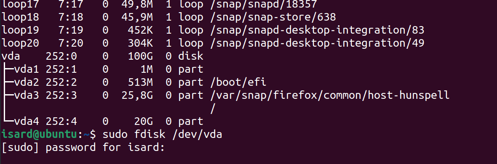

# 2. Práctica de Raid

## Reducir disco de máquina virtual

- Iniciamos con gparted/srcd i boot de cd
- Reducimos disco
- Paramos, editamos para arrancar de hard disk

## RAID con dos particiones

- Iniciamos y creamos dos particiones en el espacio libre de 1G cada una:

    fdisk /dev/vda

- n
- [enter] [enter] +1G
- [enter] [enter] +1G
- w

    mdadm --create /dev/md0 --level=1 --raid-devices=2 /dev/vda5 /dev/vda6
    cat /proc/mdstat
    mdadm --detail /dev/md0
    wipefs /dev/vda5

Creamos sistema de ficheros XFS:

    apt install xfsprogs
    mkfs.xfs /dev/md0

Comprobamos que todo ha ido bien haciendo el montaje:

    mount -t xfs /dev/md0 /mnt

mount opciones más performance: `mount -o defaults,noatime,nodiratime,noquota`

NOTA: Si no 'guardamos' la configuración del raid puede ser que al reiniciar nos cambie el nombre y nos dejará de funcionar el drbd porque no lo encontrará.

    mdadm --detail -scan > /etc/mdadm/mdadm.conf

    update-initramfs -u
