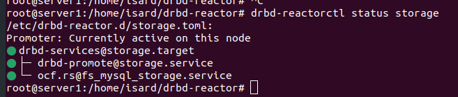
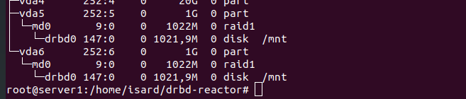

# 4. DRBD HA

Partimos de la práctica de drbd

Para hacer el que el sistema esté en alta disponibilidad tradicionamente se ha hecho con un `pacemaker` configurado en el clúster de nodos. La gente de DRBD ha visto que era muy complejo y que lo montaban mal y les repercutia en que se quejaban del DRBD, así que crearon el drbd-reactor.

    apt install -y drbd-reactor resource-agents resource-agents-extra

En /etc/drbd-reactor.d/storage.toml:

```
[[promoter]]
id = "storage"
[promoter.resources.storage]
start = [
"""
ocf:heartbeat:Filesystem fs_mnt device=/dev/drbd0 \
directory=/mnt fstype=xfs run_fsck=no""" 
]
on-drbd-demote-failure = "reboot"
on-quorum-loss = "freeze"
```

En los dos nodos reiniciamos el servicio y comprobamos si va:

    systemctl restart drbd-reactor
    drbd-reactorctl status storage






Ahora probamos la alta disponibilidad forzando parada desde IsardVDI del nodo en dónde tenemos montado el sistema mientras tenemos lanzado en el otro terminal para ver si lo monta al parar el otro nodo:

    watch -n1 df -h

Debería montarlo.

## Activar firewall

En lugar de activar el firewall `ufw` de ubuntu, nosotros preferimos el `firewalld`:

    apt install firewalld -y
    firewall-cmd --list-all # veremos la interfaz pública actual y como está configurada
  

NOTA: Es posible que nos haya activado ya el servicio de firewall con lo cual el servicio de DRBD es posible que ya nos diga que se ha desconectado.

Pasamos a abrir el puerto 7900 del DRBD en el firewall. Para ello crearemos una nueva zona para la red de drbd i activaremos el firewalld en esa zona para permitir el puerto solo para las IPs de la 10.0.0.0/24:

    firewall-cmd --new-zone=drbd --permanent
    firewall-cmd --reload
    firewall-cmd --zone=drbd --add-source=10.0.0.0/24 --permanent
    firewall-cmd --zone=drbd --add-port=7900/tcp --permanent
    firewall-cmd --reload
