# 7. Clonar una ova o qcow en un escritorio Isard


Para importar un disco de una ova, un qcow o un fichero proveniente de un clonado, necesitaremos dos escritorios:


- Un escritorio donde almacenar estos ficheros donde correrá un servidor NFS, accesible desde otros escritorios como fuente de clonación. 


- Un segundo escritorio con un CD de "rescate" o "instalación" donde poder clonar el contenido del disco qcow/img/vmdk que está en el servidor NFS en el disco del escritorio. Posteriormente cambiaremos el tipo de arranque de ISO a disco duro para que arranque con el disco clonado.


## Escritorio donde clonar


Descargamos una iso de una distribución que tenga en su catálogo de paquetes todas las herramientas de virtualización. En este caso usaremos Fedora (https://fedoraproject.org/es/workstation/download). Seleccionaremos la url de descarga y creamos la iso desde Medios:


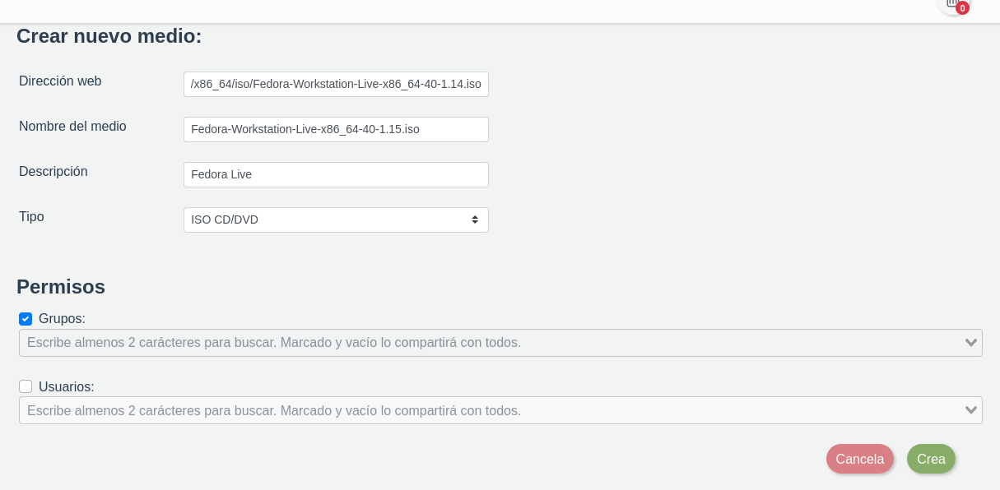


En el apartado de Medios descargamos la iso y creamos un escritorio basado en esta iso 


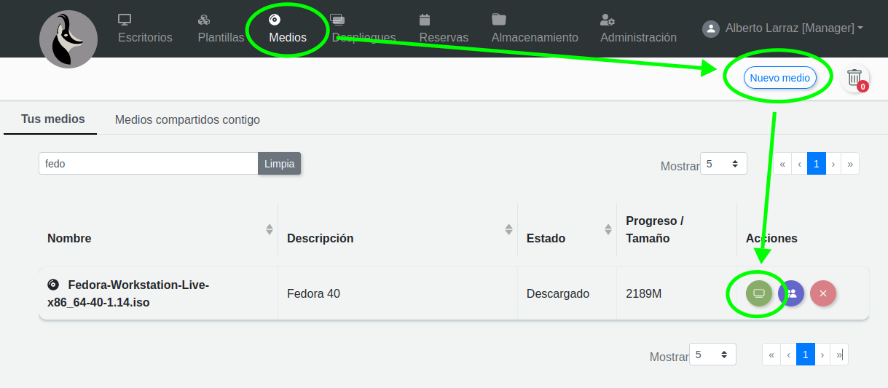


Hemos seleccionado un disco duro generoso en tamaño (80GB). Pero podemos adecuar el tamaño a algo inferior si ya sabemos que no se va a usar tanto en un futuro. También los administradores de Isard pueden recrecer un disco previamente creado.


Escogemos un perfil de hardware adecuado para el sistema operativo que querramos clonar. En este caso he seleccionado uno bastante genérico, por ejemplo: debian 10.


Añadiremos las siguientes redes y en el siguiente orden:

- **Default**: para poder salir a internet a instalar nuevos paquetes

- **Wireguard VPN**: por si queremos subir la iso directamente desde nuestro PC o comunicarnos via ssh usando ls VPN personal

- **Personal1**: para podernos comunicar con el servidor NFS siguado en esta misma red personal


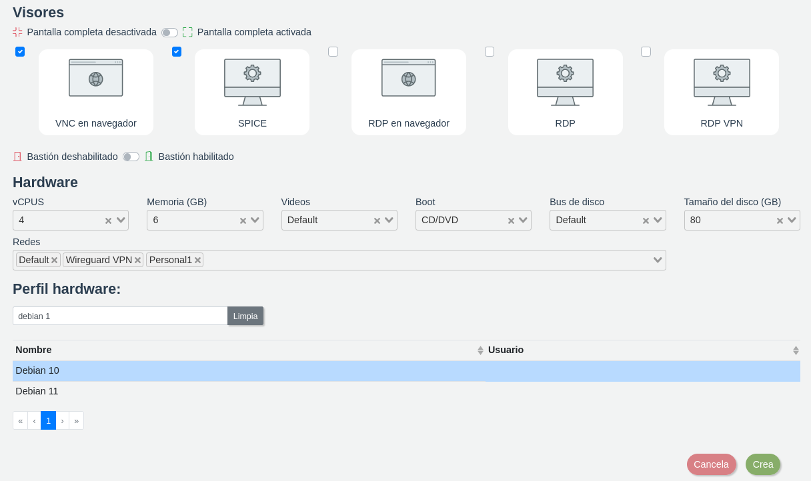


## Escritorio que hará de servidor NFS


Vamos a crear un escritorio basado en alpine, una distribución muy ligera de linux, para montar el servidor NFS.


Si el sistema no dispone de una iso de alpine, descargamos una iso de alpine y creamos un escritorio basado en esta iso.


Es importante ponerle un disco de tamaño generoso por si tenemos que ir añadiendo ficheros al servidor. En este caso de 120GB. 


Añadimos la red Personal1 para que se pueda comunicar con el otro escritorio.


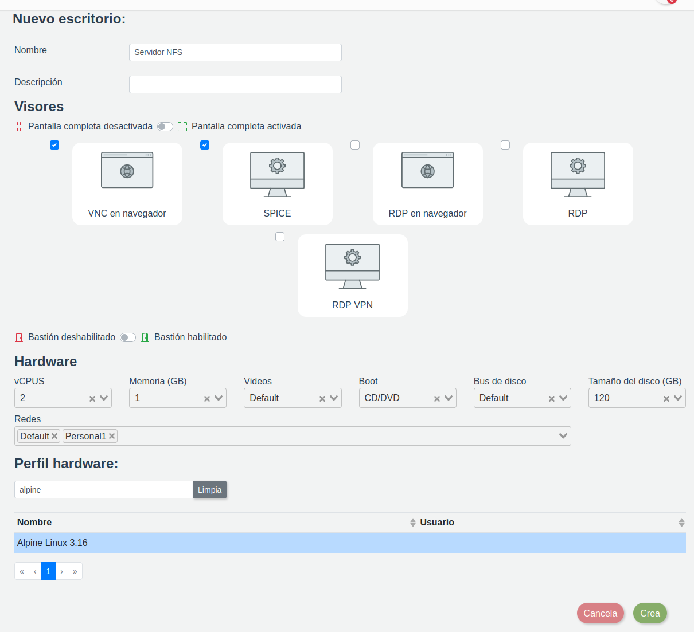


Procedemos a realizar la instalación de Alpine:


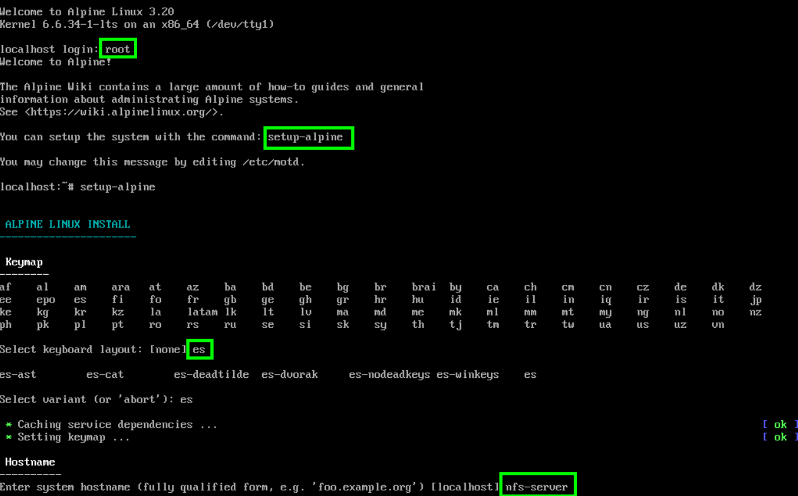


En la parte de seleccion de redes, en la red personal nos pondremo una ip privada:

- eth0: dhcp

- eth1: 192.168.99.10/24


Como password de root seguimos poniendo el password habitual: "pirineus".


Continuamos la instalación escogiendo la zona horaria, mirror, no creamos usuarios, permitimos que por ssh te puedas conectar como root


Seleccionamos el disco y finaliza la instalación, hacemos un "poweroff" al final para poder cambiar el dispositivo de arranque al disco duro con el escritorio apagado:


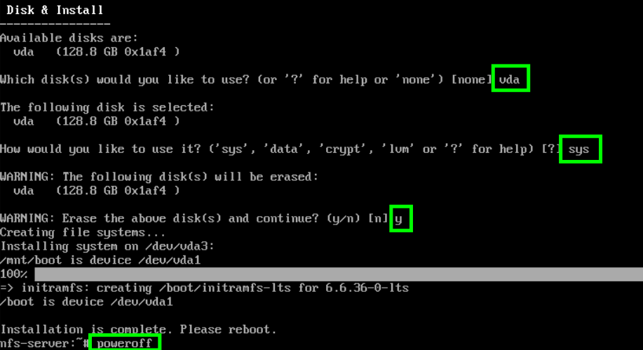


Editamos el escritorio cambiando el dispositivo de arranque y eliminando la iso como medio:


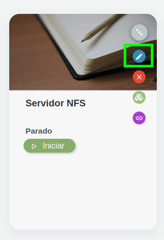


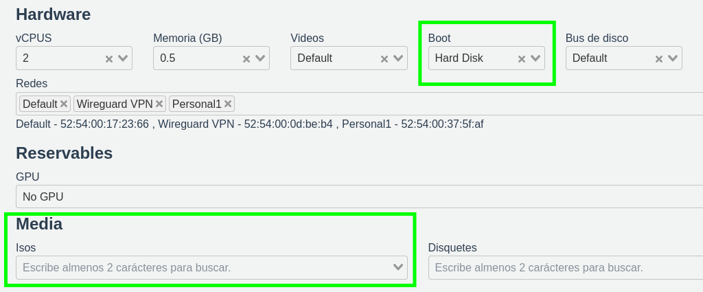


Para no tener que reproducir estos pasos, podemos aprovechar el trabajo hecho para crear una plantilla con el nombre de la versión de alpine y algunas añadir en la descripción algunas características como tamaño de disco y redes para poderla identificar correctamente cuando busquemos entre las plantillas. 


- nombre: "alpine 3.20.1"

- descripción: "USER: root / PWD: pirineus - Alpine 3.20 recien instalado con red default y personal en 192.168.99.10, disco de 120GB"

- permisos: cualquier usuario de mi categoria


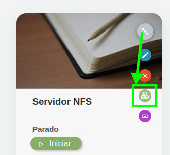


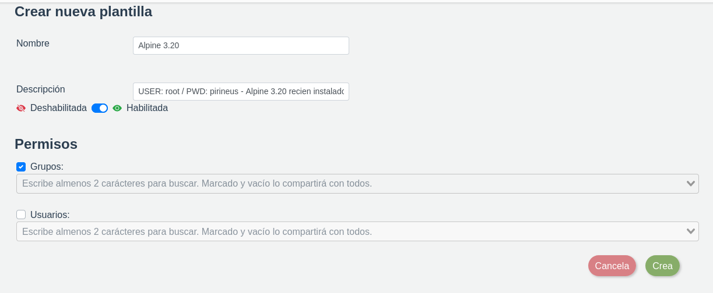


El escritorio Serviodr NFS está ahora basado en la plantilla "alpine 3.20.1"


### 


Para crear el servidor nfs seguimos la guía de la wiki de alpine (https://wiki.alpinelinux.org/wiki/Setting_up_an_NFS_server)


Ejecutamos las siguientes órdenes:


```

apk add nfs-utils iproute2

mkdir -p /export/shared

echo "/export/shared *(rw,sync,no_root_squash)" > /etc/exports

rc-update add nfs

```


Hacemos un reboot para asegurarnos que el servicio arranca y verificamos que el servicio de nfs está escuchando en los puertos asociados a este servicio:


```

ss -tlnp |grep -E "111|2049"

```


Verificamos que está exportando bien:

```

nfs-server:~# exportfs -v

/export/shared	<world>(sync,wdelay,hide,no_subtree_check,sec=sys,rw,secure,no_root_squash,no_all_squash)

```


### Conectar escritorio con servidor nfs


Arrancamos los dos escritorios:


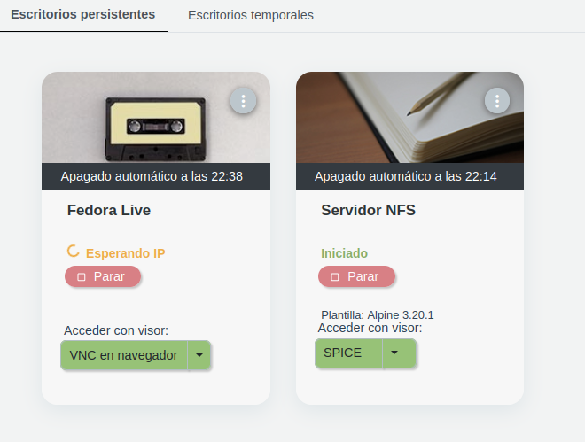


Desde Fedora Live iniciamos sin esperar a testear el medio:


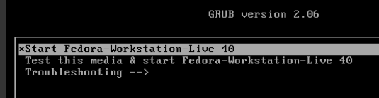


Una vez arrancado, le decimos que no queremos instalar Fedora


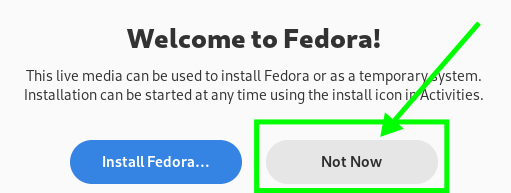


Configuramos la ip fija, para hacerlo con la interface gráfica:


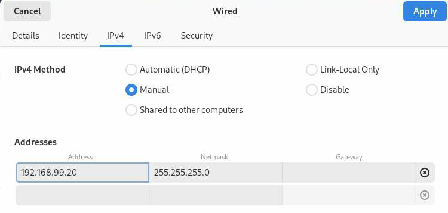


Si queremos también podemos cambiar la distribución del teclado:


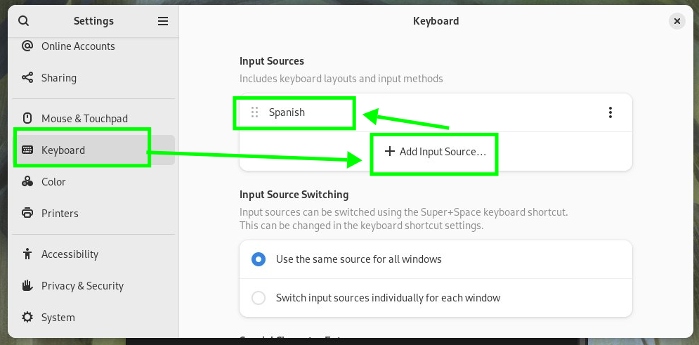


Desde la inteface gráfica de fedora podemos usar el portapapeles. Abrimos una terminal y podemos copiar y pegar el siguiente comando para hacer un ping que podemos hacer ping :

```

ping -c 1 192.168.99.10

```


Nos responde que hay comunicación:

```

1 packets transmitted, 1 received, 0% packet loss, time 0ms

```


Creamos una carpeta y montamos por nfs:

```bash

sudo mkdir /mnt/nfs

sudo mount -t nfs4 192.168.99.10:/export/shared /mnt/nfs


```


Verificmaos que ha montado bien:

```bash

liveuser@localhost-live:~$ mount |grep nfs

rpc_pipefs on /var/lib/nfs/rpc_pipefs type rpc_pipefs (rw,relatime)

192.168.99.10:/export/shared on /mnt/nfs type nfs4 (rw,relatime,vers=4.2,rsize=131072,wsize=131072,namlen=255,hard,proto=tcp,timeo=600,retrans=2,sec=sys,clientaddr=192.168.99.20,local_lock=none,addr=192.168.99.10)


```


## Clonar disco duro a partir de una ova


Como ejemplo tenemos una ova de wazuh (https://documentation.wazuh.com/current/deployment-options/virtual-machine/virtual-machine.html)


Desde fedora descargamos la ova en el directorio montado por nfs:


```

cd /mnt/nfs

sudo wget https://packages.wazuh.com/4.x/vm/wazuh-4.8.0.ova

```


Podemos usar las utilidades de qmeu para montar:


```

sudo dnf install qemu-tools-y  

sudo modprobe nbd

sudo tar xvf wazuh-4.8.0.ova

sudo qemu-nbd --connect=/dev/nbd0 /mnt/nfs/wazuh-4.8.0-disk-1.vmdk

```


Verificamos que ha montado:

```

liveuser@localhost-live:/mnt/nfs$ lsblk /dev/nbd0

NAME       MAJ:MIN RM SIZE RO TYPE MOUNTPOINTS

nbd0        43:0    0  50G  0 disk 

├─nbd0p1    43:1    0  50G  0 part 

└─nbd0p128 259:1    0   1M  0 part 

```


Y clonamos con dd en bloques de 4M y mostrando el progreso:


```

sudo dd if=/dev/nbd0 of=/dev/vda bs=4M status=progress

```


Una vez ha finalizado, apagamos el escritorio de fedora y modificamos el escritorio:

- le cambiamos el nombre por wazuh

- quitamos iso de fedora

- cambiamos para que arranque desde disco duro

- cambiamos el bus a SATA (es más estándar que usar bus VIRTIO)

- dejamos sólo las redes que nos interesan para ese desktop

- subimos la ram hasta 8GB (lo recomienda wazuh)


Conseguimos arrancar la máquina. Aunque se queja de que no encuentra algunos dispositivos de virtual box como la tarjeta de vídeo, eso no le impiede arrancar y funcionar correctamente usando la VGA Default.


Una vez ha arrancado podemos iniciar sesión con:

- user: wazuh-user

- pwd: wazuh


Cambiamos el teclado a español:

```

sudo loadkeys es

```


Añadir una ip manualmente:

```

sudo ip link set eth2 up

sudo ip a a 192.168.99.30/24 dev eth2

```


Creamos un escritorio por ejemplo basado en ubuntu 22.04, añadiendo la red personal1, y configurándola con una ip de la familia 192.168.99.0/24.


Verificamos que wazuh se está ejecutando accediendo vía web, y también podemos acceder vía ssh como se aprecia en ls siguiente captura de pantalla:


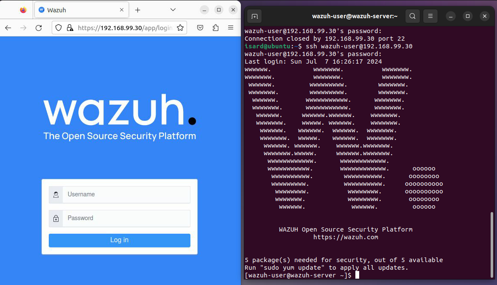


### Troubleshooting


Es recomendable cambiar al bus SATA en la mayoría de OVAs, y posteriormente probar si también reconoce el disco con el bus VIRTIO.


Si se trata de un windows o un sistema operativo muy antiguo, puede que no detecte las tarjetas de red tipo virtio hasta que instalemos los drivers. Cambiando por una red con tarjeta "intel" o "Realtek" ha de ser compatible. 