# 8. Servidor de PostgreSQL compartido con alumnos


Servidor de base de datos compartido con alumnos para una práctica de PostgreSQL en un servidor de Isard sin configuraciones de red.


## Escenario:


```

                     ┌────────────────────────┐                    

                     │                        │                    

                     │ ROUTER SALIDA DEFAULT  │                    

                     │                        │                    

                     └────────────┬───────────┘                    

                                  │.1                              

          ┌───────────────────────┼────────────────────────┐       

          │                       │                        │       

          │   192.168.120.0/22    │                        │       

 ─────┬───┴─────────      ─────┬──┴─────────     ──────┬───┴───────

      │   default              │                       │           

      │                        │                       │           

 ┌────┴─────────┐          ┌───┴──────────┐      ┌─────┴────────┐  

 │              │          │              │      │              │  

 │ servidor     │          │  cliente1    │      │ cliente2     │  

 │              │          │  ubuntu      │      │ ubuntu       │  

 │ postgres     │          │  postgres    │      │ postgres     │  

 │              │          │              │      │              │  

 │              │          │              │      │              │  

 │              │          │              │      │              │  

 │              │          │              │      │              │  

 └──────┬───────┘          └──────┬───────┘      └──────┬───────┘  

        │.20                      │dhcp                 │dhcp      

        │                         │                     │          

        │                         │                     │          

        │     192.168.222.0/24    │                     │          

────────┴──────┬──────────────────┴─────────────────────┴──────────

               │         red de grupo: grupo_bbdd                  

               │                                                   

               │.10                                                

       ┌───────┴───────┐                                           

       │               │                                           

       │               │                                           

       │  servidor     │                                           

       │  DHCP         │                                           

       │  alpine       │                                           

       │               │                                           

       │               │                                           

       └───────────────┘                                           

```


## Crear recursos y usuarios en Isard


Si no tenemos un grupo de alumno hay que crearlo:


Crear grupo:


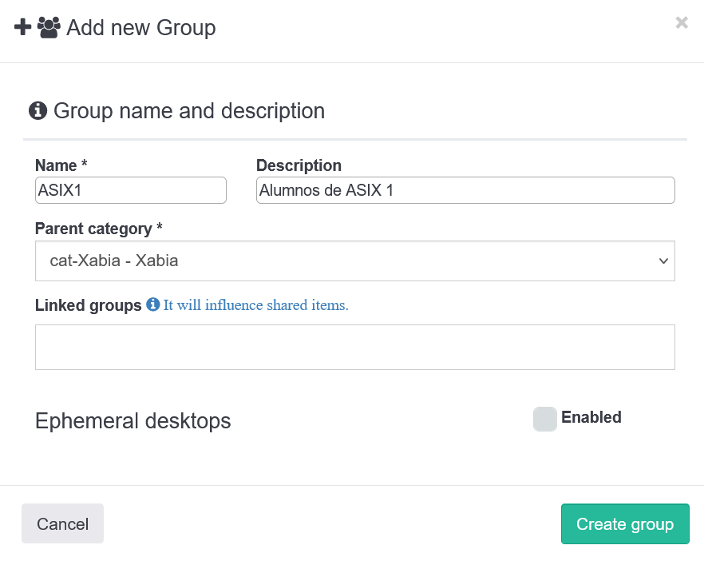


Vamos a usar una red de grupo, que ha de ser visible también por los alumnos. 


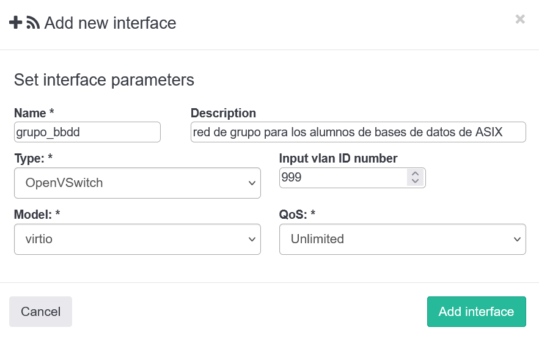


Compartirla con los alumnos. Buscamos la red y le damos al botón de las "personitas":


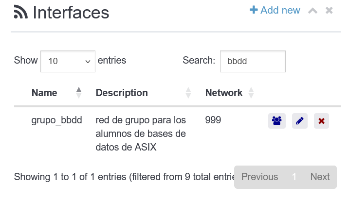


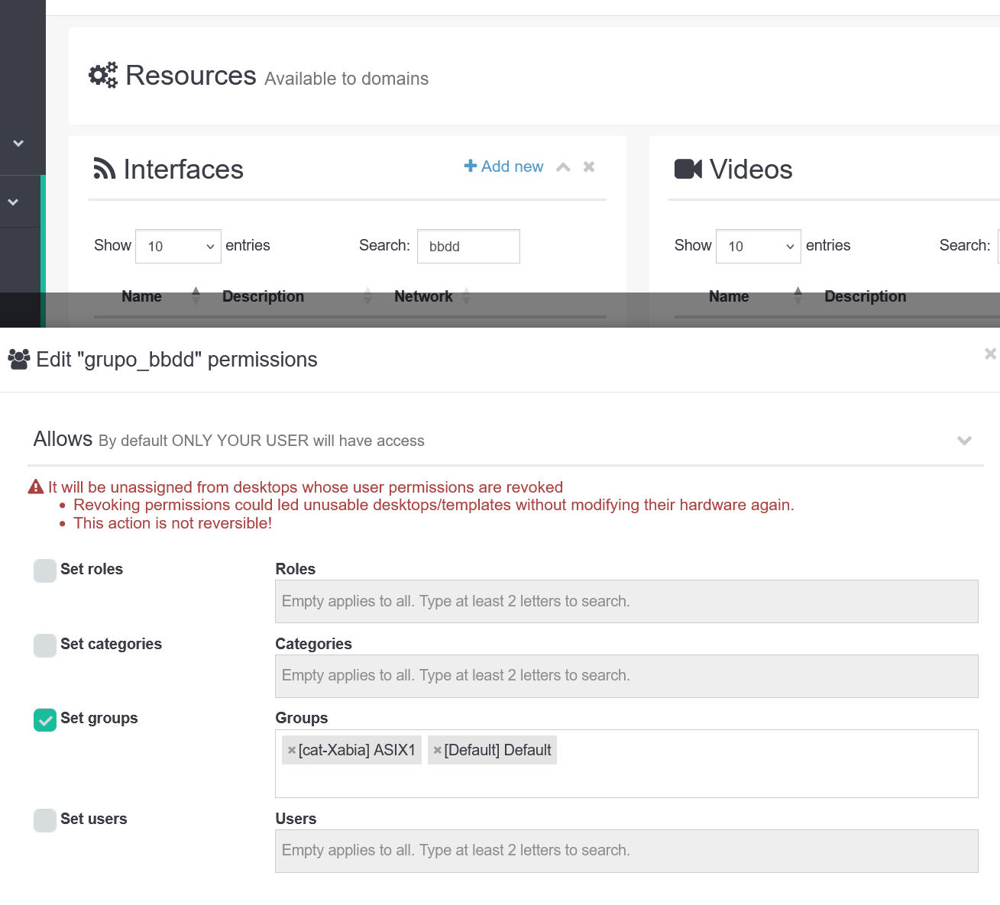


## Escritorio servidor postgres


Seleccionar una plantilla base: **debian_11.6**


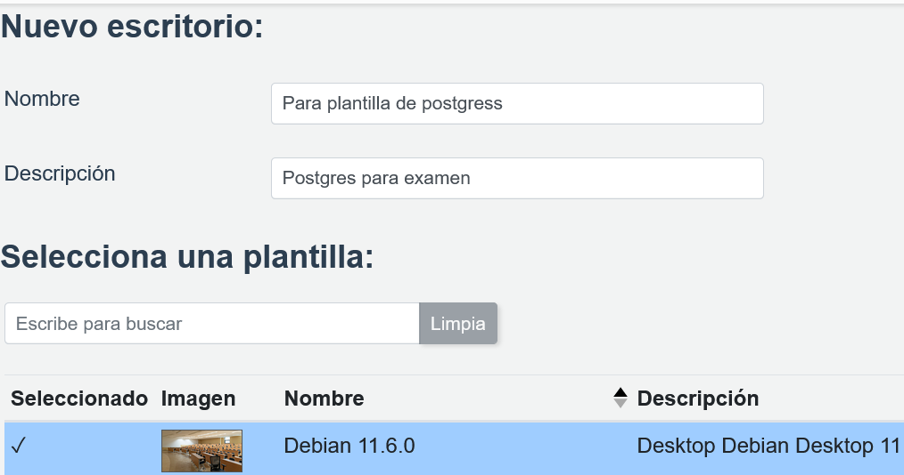


Seleccionar las redes y visores:

- Default: necesitamos salir a Internet para instalar paquetes

- Grupo: red de grupo, recordamos que no tiene servidor DHCP


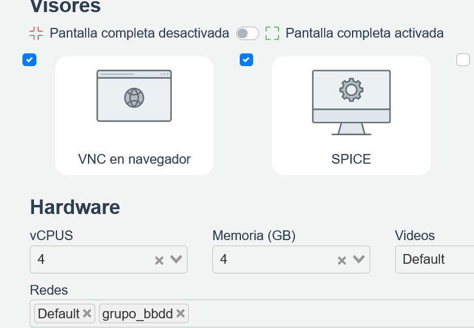


Creamos el escritorio y lo arrancamos. Nos conectamos por el visor spice porque nos permitirá copiar y pegar comandos desde mi sistema operativo de mi máquina física al escritorio.


### Configuraciones de los nombres de las interfaces de red


Arrancamos una consola dentro del escritorio y ejectuamos las siguientes órdenes:


```

sudo bash -c 'cat > /etc/udev/rules.d/70-persistent-net.rules << EOF

SUBSYSTEM=="net", ACTION=="add", DRIVERS=="?*", ATTR{type}=="1", KERNEL=="enp1s0", NAME="inet"

SUBSYSTEM=="net", ACTION=="add", DRIVERS=="?*", ATTR{type}=="1", KERNEL=="enp2s0", NAME="grupo"

EOF'

```


## Servidor DHCP con Alpine Linux


### Crear plantilla alpine base


1. Descagamos la iso de instalación Alpine-Standar

2. Si no nos funciona la url de descarga podemos usar https://isos.isardvdi.com o buscar otro sitio de descarga: [https://dl-cdn.alpinelinux.org/alpine/latest-stable/releases/x86_64/](https://dl-cdn.alpinelinux.org/alpine/latest-stable/releases/x86_64/)

3. Creamos escritorio a partir de iso: 

  - 0.5GB de ram

  - 2 cpus, red default para poder instalar

  - plantilla de hardware: alpine 3.16 (la última que haya disponible)

5. Hacemos la instalación del sistema operativo

6. Actualizamos paquetes y shutdown

```

apk update

apk upgrade

poweroff

```

7. Convertimos el escritorio en plantilla para tener una plantilla de alpine "base".


- Quitar la iso de la plantilla

- Boot: Hard disk

- Que sólo tenga la red Default

- Asegurarte que está la plantilla habilitada y con los permisos necesarios. Lo puedes modificar en el listado de plantillas en los botones de "ojo" y "personitas":


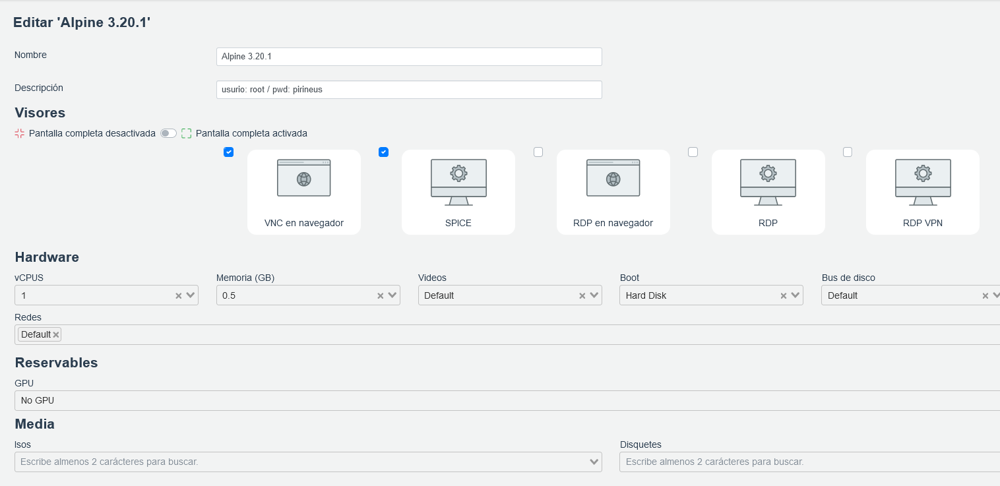


### Conectar por ssh al router desde un escritorio gráfico para usar el portapapeles


8. Vuelvo a arrancar el escritorio, que ahora depende de esta plantilla que acabamos de crear. Me aseguro de tener la red de grupo conectada.


9. Quiero tener acceso por una consola donde pueda copiar/pegar comandos. Lo más sencillo es desde un escritorio con entorno gráfico donde con el cliente spice puedo copiar y pegar, conectarme con una ip fija via ssh.

- En el servidor dhcp nos ponemos una ip en la segunda interface:

```

ip link set eth1 up 

ip a a 192.168.222.10/24

ip a a 192.168.222.10/24 dev eth1


```


Creamos un cliente basado en fedora. 


- En el cliente nos ponemos otra ip de la misma familia


```

[isard@fedora ~]$ sudo systemctl stop NetworkManager.service 

[isard@fedora ~]$ sudo ip a a 192.168.222.20/24 dev enp2s0

[isard@fedora ~]$ ping -c 1 192.168.222.10

PING 192.168.222.10 (192.168.222.10) 56(84) bytes of data.

64 bytes from 192.168.222.10: icmp_seq=1 ttl=64 time=3.84 ms


--- 192.168.222.10 ping statistics ---

1 packets transmitted, 1 received, 0% packet loss, time 0ms

rtt min/avg/max/mdev = 3.844/3.844/3.844/0.000 ms

```


Y nos conectamos vía ssh


### Crear plantilla alpine-redes


Ahora queremos dejar una plantilla de alpine lista para trabajar con redes, con un script inicial que se ejecutará y donde los alumnos podrán ir introduciendo órdenes básicas de linux para confiurar interfaces, iptables.


La idea es tener una plantilla donde practicar con los comandos básicos de linux que se ejecutarán cuando arranque la máquina.


Creamos el script y le damos permisos


```

touch /usr/local/bin/startup_script.sh

chmod u+x /usr/local/bin/startup_script.sh

```


Instalamos la shell bash:

```

apk add bash

```


Activamos el bit de forwarding para el siguiente inicio:

```

#activar bit de forwarding para que pueda funcionar como router

echo "net.ipv4.ip_forward = 1" >> /etc/sysctl.conf

```


El contenido del script puede ser;


```bash

#!/bin/bash


ip a s >> /tmp/log_ip.txt

```


Creamos el fichero de servicio:


```

touch /etc/init.d/router

chmod u+x /etc/init.d/router

```


El contenido del fichero de servico:


```bash

#!/sbin/openrc-run


depend() {

    after sshd

}


start() {

    ebegin "router starting"

    /usr/local/bin/startup_script.sh

    eend $?

}

```


Activamos el servicio:


```bash

rc-update add router default

```


Hacemos reboot y podemos verificar si está activo después de un reboot mirando:


```bash

cat /proc/sys/net/ipv4/ip_forward

```


Añadimos paquetes de redes:


```

apk add iptables iproute2 dnsmasq

```


Apagamos y creamos plantilla **alpine redes v1**


### Crear servidor DHCP


Desconectamos la red default, nos quedaremos sólo con una interface de grupo.


Ejecutamos el setup de interfaces de alpine:


```

dhcp-server:~# setup-interfaces 

Available interfaces are: eth0.

Enter '?' for help on bridges, bonding and vlans.

Which one do you want to initialize? (or '?' or 'done') [eth0] 

Ip address for eth0? (or 'dhcp', 'none', '?') [192.168.222.10] 192.168.222.10/24

Gateway? (or 'none') [none] none

Configuration for eth0:

  type=static

  address=192.168.222.10

  netmask=255.255.255.0

  gateway=

Do you want to do any manual network configuration? (y/n) [n] n


```


### SERVIDOR DHCP

Pasamos a configurar el servidor de dhcp:


creamos fichero de configuración:

```

cat <<'EOF' > /etc/dnsmasq.conf

interface=eth0

dhcp-range=192.168.222.20,192.168.222.199,255.255.255.0,24h

log-dhcp

dhcp-leasefile=/var/lib/dnsmasq.leases

EOF

```


Arrancamos el servicio, y lo activamos para que se inicie al hacer boot:


```

rc-service dnsmasq start

rc-update add dnsmasq

```


reboot, verificamos con un cliente que da ip y que quedan en los logs:


```

dhcp-server:~# cat /var/lib/dnsmasq.leases 

1720464611 52:54:00:55:c4:d7 192.168.222.78 * *

```


Ya podemos apagar el escritorio y hacer una plantilla de servidor-dhcp-alpine


## Servidor postgres en debian


### Plantilla debian12 -server


Creamos un escritorio debian basado en la iso de debian 12


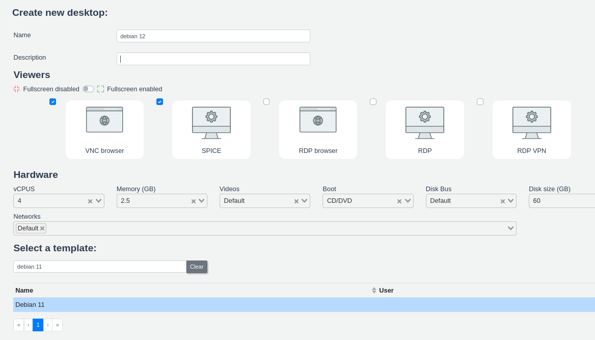


Instalamos como servidor, sin seleccionar entorno gráfico. Seleccionamos ssh server.


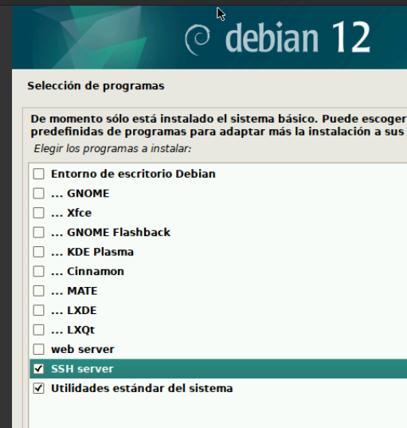


Con el escritorio apagado, cambiamos el arranque a disco duro, quitamos iso y creamos plantilla debian12-server


### Instalar servicio de postgres


Añadimos la interface de la red de grupo:


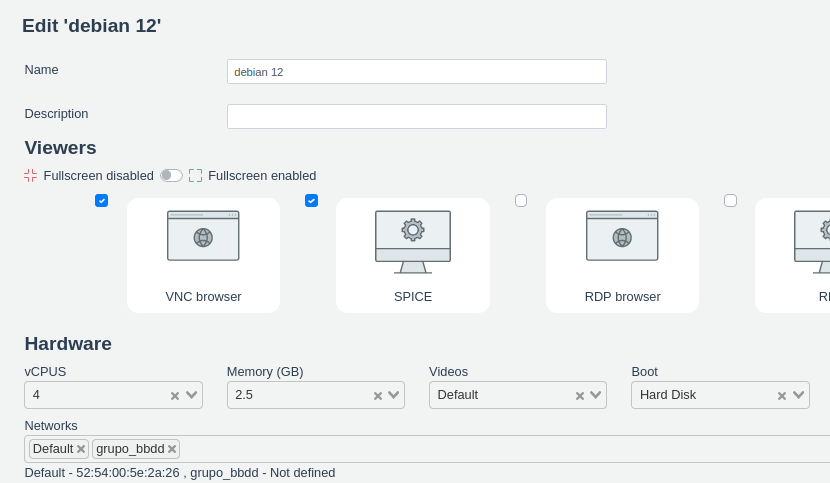


Congifuramos la interface. Por defecto debian 12 configura la red usando el servicio networking y el fichero /etc/network/interfaces. 


Nos convertimos en root y añadimos estas líneas para la configuración de la segunda tarjeta (enp2s0):


```

auto enp2s0

iface enp2s0 inet static

    address 192.168.222.20

    netmask 255.255.255.0


```


Reiniciamos el servicio:


```

systemctl restart networking

```


Instalamos sudo:


```

apt install sudo

usermod -aG sudo isard

echo 'isard ALL=(ALL) NOPASSWD:ALL' | tee /etc/sudoers.d/isard

isard ALL=(ALL) NOPASSWD:ALL

```


Iniciamos sesión como isard y verificamos que podemos hacer sudo sin que nos pida password


Instalamos los paquetes de postgres:


```

sudo apt update

sudo apt install -y postgresql postgresql-contrib


```


Configuramos que el servidor sea accesible por otros equipos:

```bash

#Cambiar listen_addresses a '*' en postgresql.conf

sudo sed -i "s/^#listen_addresses = 'localhost'/listen_addresses = '*'/" /etc/postgresql/15/main/postgresql.conf


#Añadir la línea en pg_hba.conf 

echo "host    all             all             0.0.0.0/0               md5" | sudo tee -a /etc/postgresql/15/main/pg_hba.conf

```


Verificamos que ha quedado bien configurado


```bash

isard@debian12:~$ grep listen_address /etc/postgresql/15/main/postgresql.conf

listen_addresses = '*'		# what IP address(es) to listen on;

isard@debian12:~$ sudo tail -n 1 /etc/postgresql/15/main/pg_hba.conf 

host    all             all             0.0.0.0/0               md5

```


Reiniciamos servicio y lo dejamos enable:

```

sudo systemctl restart postgresql

sudo systemctl enable postgresql

```


Accedemos al shell de PostgreSQL:

```

sudo -u postgres psql

```


Creamos base de datos, con un usuario y concedemos todos los privilegios:

```

CREATE DATABASE testdb;

CREATE USER testuser WITH ENCRYPTED PASSWORD 'pirineus';

GRANT ALL PRIVILEGES ON DATABASE testdb TO testuser;

\q

```


Creamos un usaurio superuser que tenga todos los privilegios en postgres:


```

CREATE USER superuser WITH PASSWORD 'pirineus';

ALTER USER superuser WITH SUPERUSER;


```


## Clientes postgres en fedora


Creamos un escritorio basado en fedora 40. Actualizamos paquetes y reboot.


```

sudo dnf update

reboot

```


Para instalar cliente de postrgres por línea de comandos:

```

sudo dnf search postgresql

sudo dnf install postgresql

sudo systemctl disable postgres

```


Verificamos que funciona:

```

psql

```


Instalar pgadmin4 t cliente pgadmin4-desktop


```

sudo dnf -y install pgadmin4-langpack-es pgadmin4


sudo rpm -i https://ftp.postgresql.org/pub/pgadmin/pgadmin4/yum/pgadmin4-fedora-repo-2-1.noarch.rpm


sudo dnf install -y pgadmin4-desktop

```


Para instalar el cliente dbeaver vamos a la web de dbeaver y descargamos el fichero .rpm y lo instalamos.


Verificamos que los clientes funcionan y podemos conectarnos:


Cliente por línea de comandos y creamos una tabla

```

PGPASSWORD="pirineus" psql -h 192.168.222.20 -U superuser -d testdb

```


Nos conectamos y creamos una tabla:

```

CREATE TABLE test (

    id SERIAL PRIMARY KEY,

    description TEXT

);

```


En pgAdmin4 configuramos la conexión y creamos una fila en la tabla test


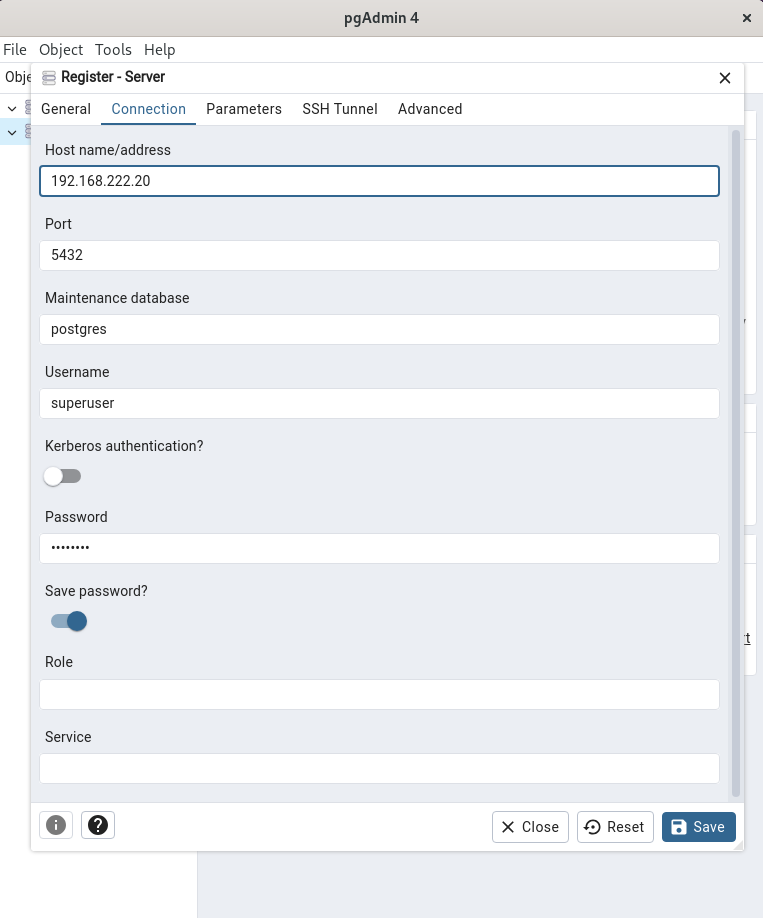


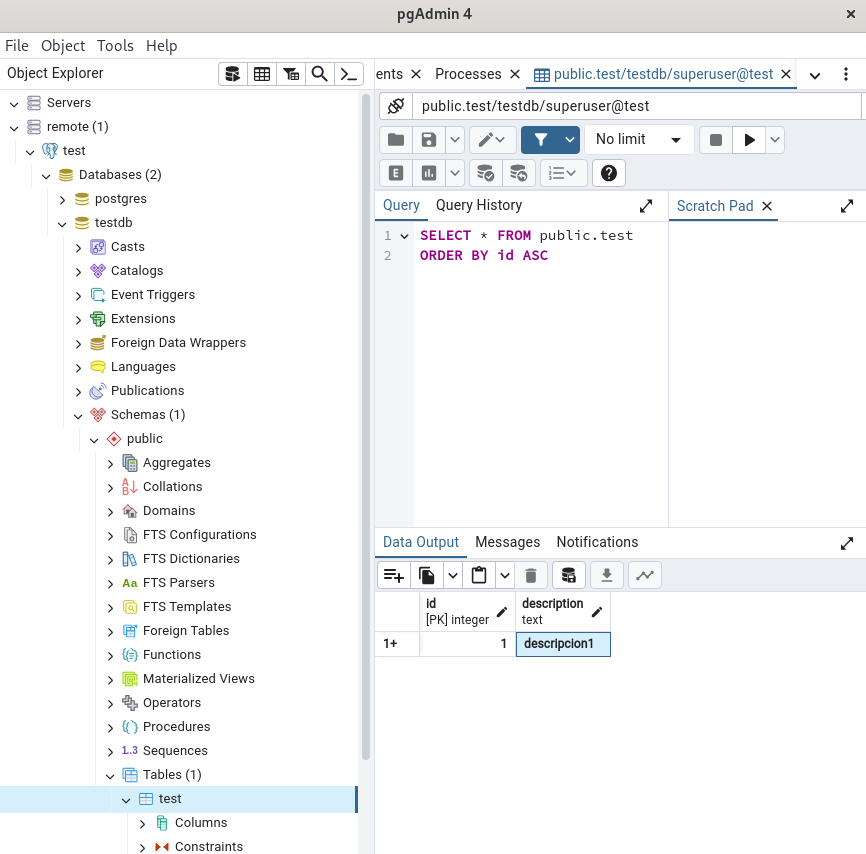


En DBeaver también dejamos preparada la conexión:


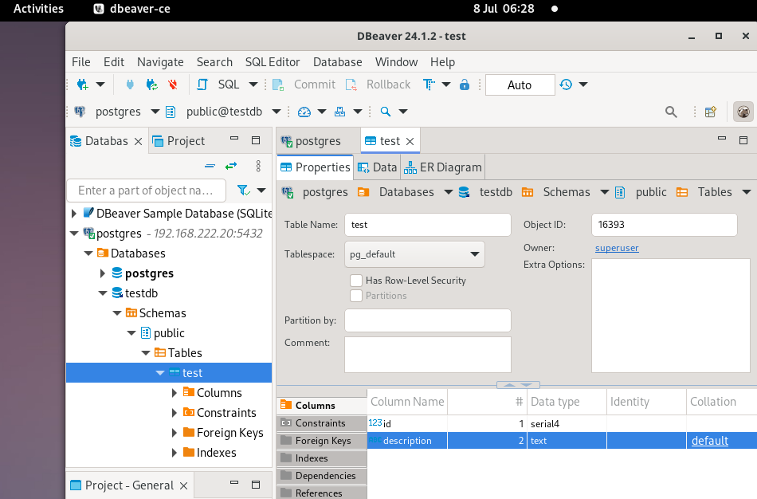


## Desplegar a usuarios


Hacemos plantillas del servidor de postgres y del escritorio con los clientes. 


Ya podemos desplegar el escritorio con los clientes y que los alumnos ataquen a la misma base de datos usando la red de grupo.


Para que el escenario funcione el docente ha de encender previamente el servidor dhcp y el servidor de base de datos.


