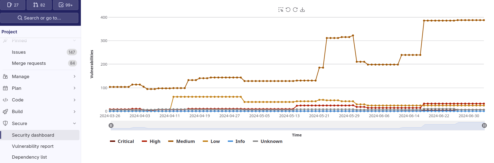
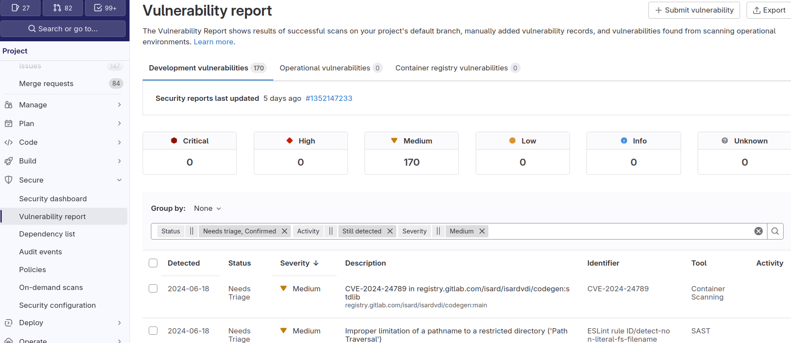
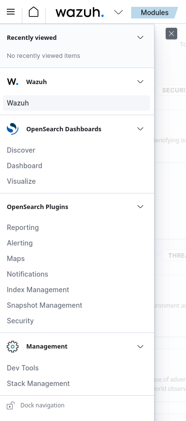
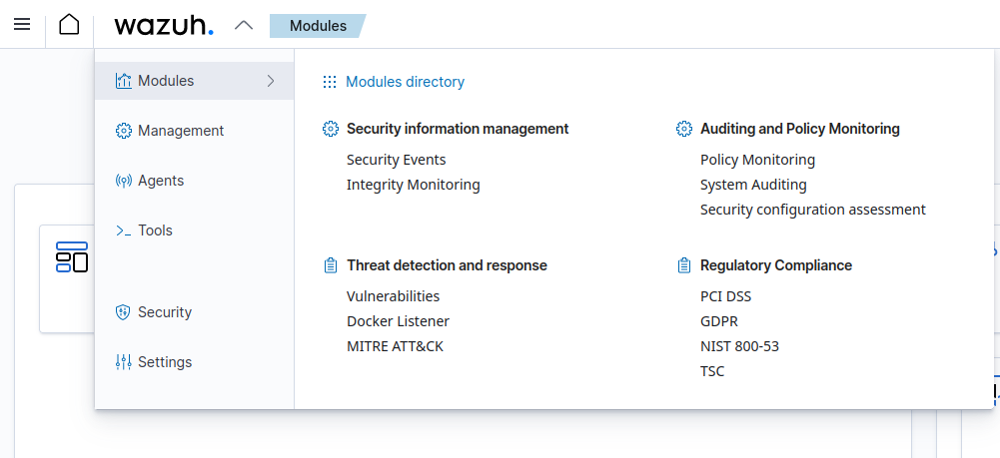
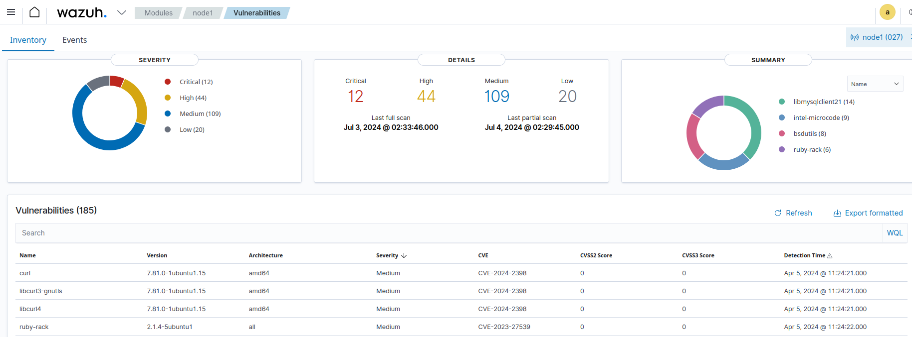
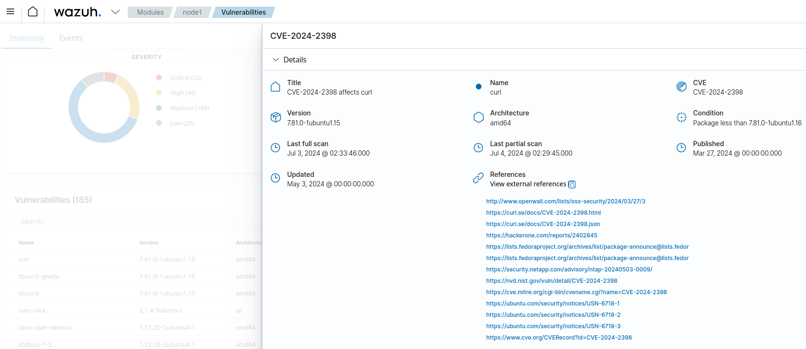

# Seguridad Aplicativo (web)

Mecanismos de protección de los accesos web

## HAPROXY

Nos permitirá derivar las peticiones al servicio correspondiente. Basándose en casi cualquier cosa que se pueda parsear de la petición.

- https://www.haproxy.org/

En isard añadimos también las blacklist de nuestro firewall.

- Blacklist

También incluye diversas sobreescrituras de cabeceras para securizar los accesos web, por defecto:

- PenTesting: https://portswigger.net/burp

Cabeceras:

```
# Security Headers
#https://cheatsheetseries.owasp.org/cheatsheets/HTTP_Headers_Cheat_Sheet.html
http-response del-header X-Powered-By
http-response del-header Server
http-response set-header Strict-Transport-Security "max-age=63072000; includeSubDomains; preload"
http-response add-header X-Frame-Options DENY
http-response add-header X-XSS-Protection 0
# http-response set-header Content-Security-Policy:script-src https://<scripts domains> (only in devel)
http-response add-header Referrer-Policy no-referrer
http-response add-header X-Content-Type-Options nosniff

# BEGIN CORS
http-response add-header Access-Control-Allow-Origin "${CORS}"
http-response add-header Access-Control-Allow-Headers "Origin, X-Requested-With, Content-Type, Accept, Authorization"
http-response add-header Access-Control-Max-Age 3628800
http-response add-header Access-Control-Allow-Methods "GET, POST, PUT, DELETE"
```

## WAF

Es un cortafuegos que analizará las diferentes capas en las peticiones y/o respuestas web contrastando contra patrones de ataques para poder realizar acciones.

### OWASP

Reglas de cortafuegos WEB

- https://owasp.org/about/
- https://github.com/coreruleset/coreruleset

### WAF APPS

Cortafuegos WEB

- https://github.com/owasp-modsecurity/ModSecurity
- https://github.com/corazawaf/coraza

# SAST

Análisis estático (librerías):





# DAST

Análisis dinámico.

Ataques de caja blanca/caja negra.

# SIEM

- https://wazuh.com/









Ejemplos de páginas con vulnerabilidades:

- https://cve.mitre.org/cgi-bin/cvename.cgi?name=CVE-2024-2398

- https://nvd.nist.gov/vuln/detail/CVE-2024-2398

- https://ubuntu.com/security/notices/USN-6718-1
